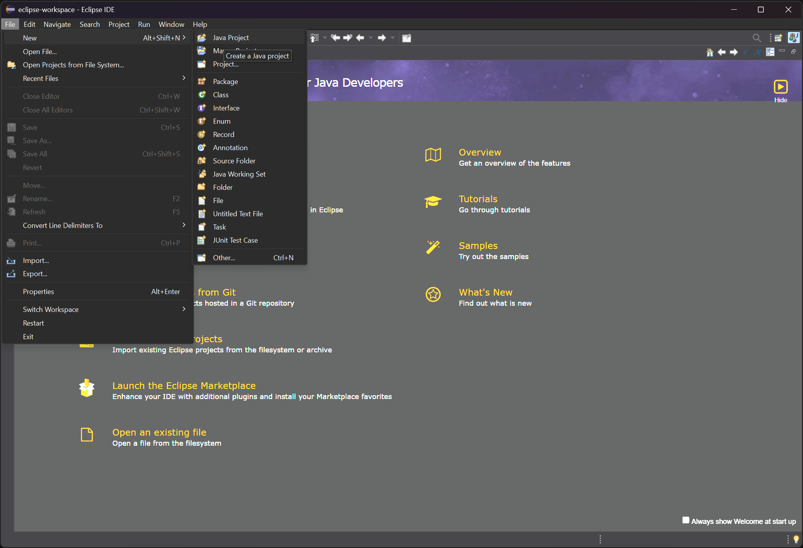

# Unit 1.1 Hello World

This unit we will download the IDE(Integrated Developement Environment) -- tool to edit java program and run a basic program. Eclipse is the tool we use for this class since it's simple and free to use. Please click [this link](https://www.eclipse.org/downloads/) and download the correct version for your operating system. 

After download, open the installer then select `Eclipse IDE for Java Developers`, then install.


Once installed, click Launch and start Eclipse. First window will show you the workspace directory, it's okay to leave it as is, you may also change it to a location you like. Then follow the screenshots below to start a new java project. 



After click finish, you're greeted with the welcome window. Simply close the welcome tab here.


Next, right click on `src` in the left panel and create a new class. Follow the values changed in red boxes and finish.


By now you should see a new java file created with some code. Please copy the exact code below into the new file you just created `FirstProgram.java`. [Source reference](./src/FirstProgram.java)
```java
public class FirstProgram {
	public static void main(String[] args) {
		// TODO Auto-generated method stub
		System.out.println("Hello world!");
	}
}
```

Finally, click run. You should see "Hello World!" being printed in the console.
