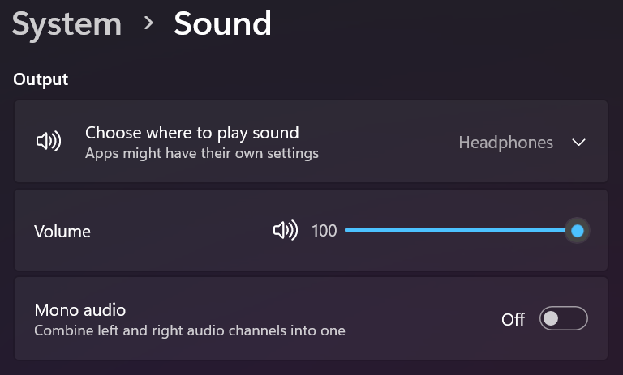

# Unit 1.2 Variables and Data Types

**Data Type** is a set of values and a set of operations on them. All java data types are either **primitive** or **reference** type. 

Primitive type data are directly stored in computer memory with raw values. \
Reference type data are stored in a blob of memory, where the address of the blob is saved for a variable.

In AP CSA, there are only 3 primitive data types:
1. int - integer
2. double - floating point numbers
3. boolean - true or false

--- 
**Variable**:  A piece of the computer's memory that is given a name and type, and can store a value. Variables are often used so that certain data can be reused later in the program.

How does a user control the volume of a computer? A variable to store the value of volume!\

Imagine a world without variables. You went to a restaurant for dinner and your waiter hands you a check before you leave. The check is generated by the program below:
```java
System.out.println("Subtotal:");
System.out.println(38 + 40 + 30);
System.out.println("Tax:");
System.out.println((38 + 40 + 30) * .08);
System.out.println("Tip:");
System.out.println((38 + 40 + 30) * .15);
System.out.println("Total:");
System.out.println(38 + 40 + 30 +
                  (38 + 40 + 30) * .08 +
                  (38 + 40 + 30) * .15);
```

[code example](./test.java)

Do you find something long and repetitive? Notice tax, tip, total are calculated based on `subtotal`. We could simplify the code by creating a variable that stores this value.