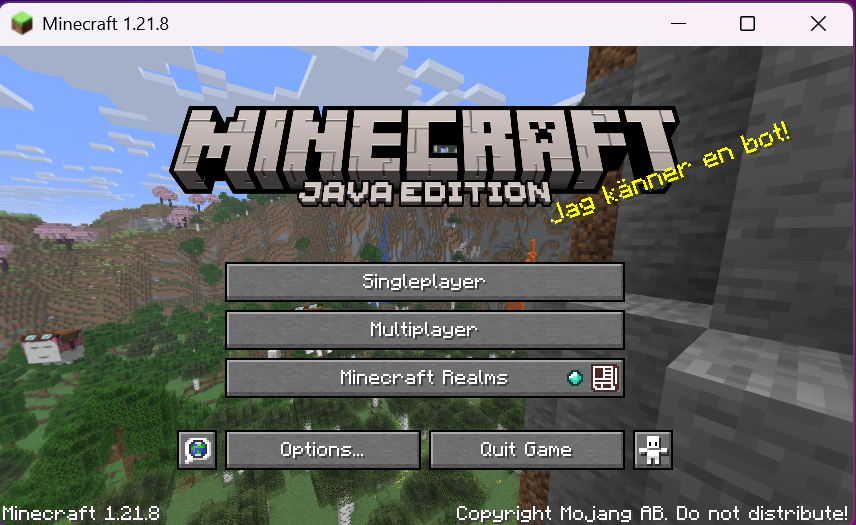
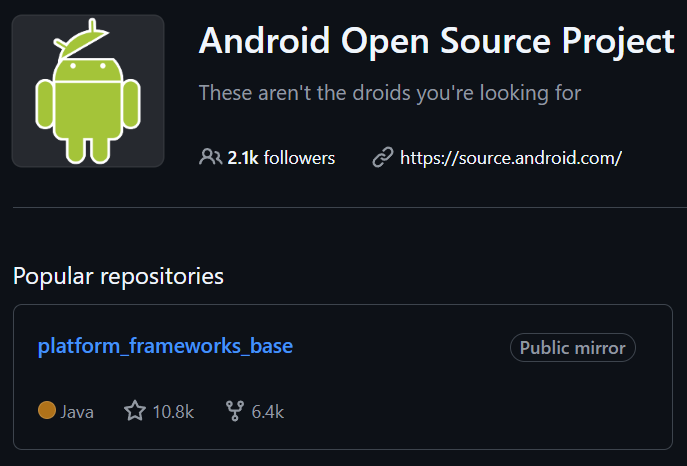
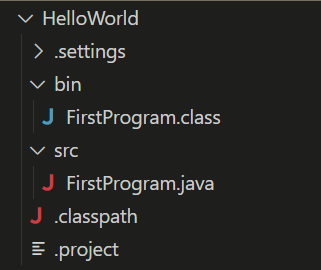
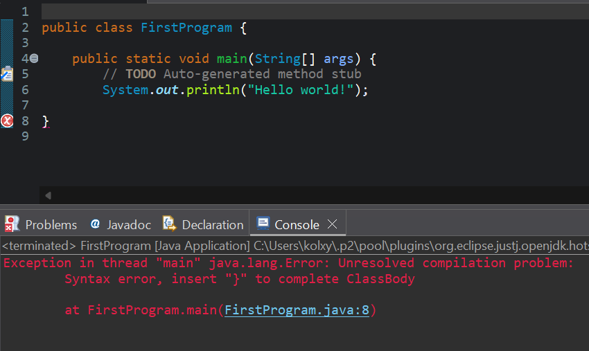

# Unit 1.1 Introduction to Programming

## Learning Goals
By the end of this unit, you will:
- Understand what a programming language is and why Java is used in AP CSA
- Learn how compilers translate code into machine-executable form
- Identify and fix syntax errors in your programs
- Add comments to explain your code
- Successfully write and run your first Java program

## 1. What is a Programming Language?

**Programming Language**: a language designed to give instructions that can be performed by computers.

**Java** is the designated programming language for AP Computer Science A. It's widely used in the world.




## 2. Compiler

**Quiz**: Can computers directly read a programming language?

**Answer**: No. Computers can only read machine code, which consist of 0s and 1s. How is a programming language translated into machine code? The answer is **compiler**. A compiler will **compile** a programming language into machine code. Remember in Unit 0, after we run `FirstProgram`, the compiler will create the machine code for this program and name it `FirstProgram.class`. The `.class` file is written in machine code.



## 3. Syntax Errors and Debugging

Many programmers make mistakes during programming. A common error is **syntax error**. It means the written code violates the syntax rules set by Java. In other words, the Java compiler cannot understand the code. Let's look at the example below. The program failed to run and generated an error message in red. There are many indications that tell you why your program failed:

1. The red squiggly line under `}`
2. The red symbol next to line 8
3. Error message indicates the problem comes from line 8: `at FirstProgram.main(FirstProgram.java:8)`



### 3.1 Practice: Find All Mistakes

Find all mistakes in the code snippet below:

```
 pooblic class Errors
    public static void main(String args){
        System.out.print("Good morning! ")
        system.out.print("Good afternoon!);
        System.Print "And good evening!";
 }
 ```

#### 3.1.1 Answer

There are about 10 mistakes. Check the corrected version below:

```java
 public class Errors {
    public static void main(String[] args){
        System.out.print("Good morning! ");
        System.out.print("Good afternoon!");
        System.out.print("And good evening!");
    }
 }
```

## 4. Comments

In Java, we can mark some text to be ignored by the compiler. Comments are often used as notes for yourself or your programming partners. There are two types of comments: