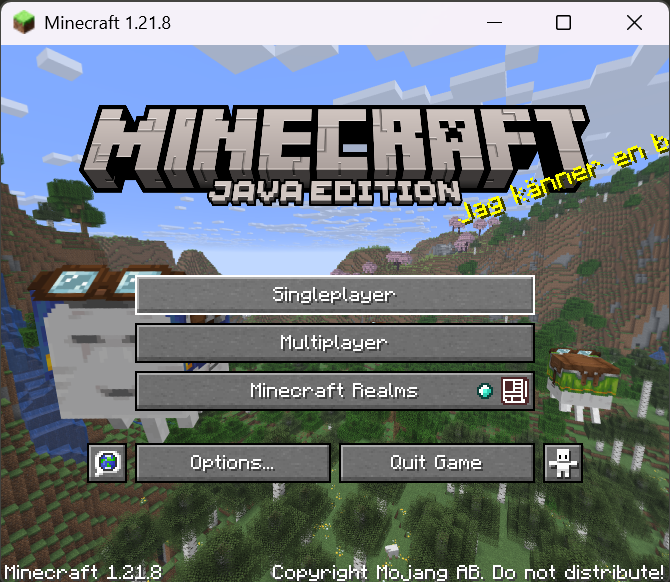

# Unit 1.1 Introduction to Programming

**Programming Language**: a language designed to give instructions that can be performed by computers. \
**Java** is the designated programming language for AP Computer Science A. It's widely used in our world.

\


## Compiler
Quiz: Can computers directly read a programming language?

Answer: No. Computers can only read machine code, which consist of 0s and 1s. How is a programming language translated into machine code? The answer is compiler. A compiler will **compile** programming language into machine code. Remember in Unit 0, after we run `FirstProgram`, the compiler will create the machine code for this program and name it `FirstProgram.class`. The `.class` file is written in machine code.


## Syntax Error and Debugging
Many programmers make mistakes during programming. A common error is **syntax error**. It means the written code violates the syntax rules set by java. In other words, java compiler cannot understand the code. Let's look a the the example below. The program failed to run and generated an error message in red. There are many indications that tells you why your program failed. 
1. The red squiggly line under `}`
2. The red symbol next to line 8
3. Error message indicates the problem comes from line 8 `at FirstProgram.main(FirstProgram.java:8)`


### Practice

Find all mistakes in the code snippet below:
```
 pooblic class Errors
    public static void main(String args){
        System.out.print("Good morning! ")
        system.out.print("Good afternoon!);
        System.Print "And good evening!";
 }
 ```

#### Answer
There are about 10 mistakes, check the answer below:

```java
 public class Errors {
    public static void main(String[] args){
        System.out.print("Good morning! ");
        System.out.print("Good afternoon!");
        System.out.print("And good evening!");
    }
 }
 ```

 ## Comment
 In Java, we can mark some text to be ignored by the compiler. Comments are often used as notes for yourself or your programming partners. There are two types of comments:
 1. Single line comment, use `//` to mark anything after it in the same line
 2. Multi line comment, use `/*` as the beginning, `*/` as the end. Anything in between would become comments.

```java
public class Comment {
    public static void main(String[] args) {
        System.out.println("Hello world"); // Print Hello world
        System.out.println("I love computer science");
        /*
        Here is the multi line comments
        It can go over many lines of text
        blah blah
        */
    }
}
```