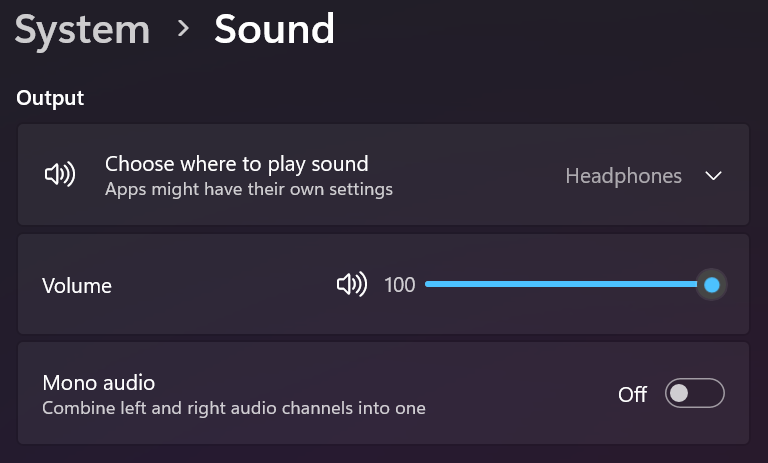

# Unit 1.2 Variables and Data Types

**Data Type** is a set of values and a set of operations on them. All java data types are either **primitive** or **reference** type. 

Primitive type data are directly stored in computer memory with raw values. \
Reference type data are stored in a blob of memory, where the address of the blob is saved for a variable.

In AP CSA, there are only 3 primitive data types:
1. int - integer
2. double - floating point numbers
3. boolean - true or false

--- 
**Variable**:  A piece of the computer's memory that is given a name and type, and can store a value. Variables are often used so that certain data can be reused later in the program.

How does a user control the volume of a computer? A variable to store the value of volume!\


Imagine a world without variables. You went to a restaurant for dinner and your waiter hands you a check before you leave. The check is generated by the program below:
```java
System.out.println("Subtotal:");
System.out.println(38 + 40 + 30);
System.out.println("Tax:");
System.out.println((38 + 40 + 30) * .08);
System.out.println("Tip:");
System.out.println((38 + 40 + 30) * .15);
System.out.println("Total:");
System.out.println(38 + 40 + 30 +
                  (38 + 40 + 30) * .08 +
                  (38 + 40 + 30) * .15);
```

Do you find something long and repetitive? Notice tax, tip, total are calculated based on `subtotal`. We could simplify the code by creating a variable that stores this value.

## Declaring variables
Variable declaration: Sets aside memory for storing a value. Variables must be declared before they can be used. 

Syntax for declaring variables
```
type name;
```
For example
```java
int a;
double b;
boolean c;
String d;
```

Computer memory:
| name | value |
|------|-------|
| a    |       |
| b    |       |
| c    |       |
| d    |       |

## Assignment
Variable assignment: Stores a value into a variable

Syntax:
```
name = type
```

Example:
```java
a = 1;
b = 2.0;
c = false;
d = "Hello world!";
```

Computer memory:
| name | value |
|------|-------|
| a    |  1    |
| b    |  2.0  |
| c    |  false     |
| d    |  Hello world!     |

## Using variables
Once a value is assigned to a variable, you can use it in expressions by calling the variable name:

```java
int x = 5;
x = 5;
System.out.println("Value of x is " + x); // Value of x is 5
x = 1 + 1
System.out.println(x + 1); // 3
```

## Variable initialization
We can combine declaration and assignment into a single line

Syntax:
```
type name = value;
```

Example:
```java
int x = 1;
double y = 1.0 + 2.2;
```

Multiple variables\
We can declare/initialize multiple variables of the same type in a single line.

```java
int x, y, z;

int x = 1, y = 2, z = 3;
```

What if we assign incompatiable types to variables?\
Let's try to assign a double to int variable
```java
int x = 1.1; // Error!
```

But what about the reverse?
```java
double x = 3;
System.out.println(x); // 3.0
```

## Practice
Now back to the receipt question, how can we optimize the code with variables?
```java
System.out.println("Subtotal:");
System.out.println(38 + 40 + 30);
System.out.println("Tax:");
System.out.println((38 + 40 + 30) * .08);
System.out.println("Tip:");
System.out.println((38 + 40 + 30) * .15);
System.out.println("Total:");
System.out.println(38 + 40 + 30 +
                  (38 + 40 + 30) * .08 +
                  (38 + 40 + 30) * .15);
```

#### Answer
```java
int subtotal = 38 + 40 + 30;
double tax = subtotal * 0.08;
double tip = subtotal * 0.15;
double total = subtotal + tax + tip;

System.out.println("Subtotal: " + subtotal);
System.out.println("Tax: " + tax);
System.out.println("Tip: " + tip);
System.out.println("Total: " + total);
```

## int
`int` type in Java represent integers, i.e. numbers with no fractional part such as 3, 0, -76, and 20393

```java
int a = 1;
int b = -10;
int c = 0;
int d = 10 + 111;
int e = a + b + c;
```

## double
`double` represents non-integer numbers i.e. 1.2, -0.2, 123.456, 1.0, 0.0. Some people call it `float` because there is a floating point between the integer and fractional part. 
```java
double a = 1.0;
double b = -0.2;
double c = 1.0 + 2.0;
```

## boolean 
`boolean` is a logical type that only has 2 possible values: `true` and `false`.
```java
double gpa = 3.8;
boolean isHonorRoll = gpa > 3.5;
boolean a = false;
System.out.println(isHonorRoll); // true
System.out.println(a); // false
System.out.println(4 <= 5); // true
```

## final
The final keyword makes a variable to be constant. Once the variable is assigned a value **once**, it **CANNOT** be assigned with another value afterwards.
```java
final double PI = 3.14;
System.out.println(PI); // 3.14
PI = 4.2 // ERROR
```

## Naming convention
Variable name should describe what the data represents. For example, we should use the variable name `double gpa` to represent student's grade instead of something like `double x`.

The convention in Java and many programming languages is to always start a variable name with a lower case letter and then uppercase the first letter of each additional word.

Variable names **can not include spaces** so uppercasing the first letter of 
each additional word makes it easier to read the name. Uppercasing the first 
letter of each additional word is called camel case.

```java
int numberOfStudents;
```

Another option is to use underscore symbol _ to separate words, but you cannot have spaces in a variable name. Java is case sensitive so playerScore and playerscore are not the same.

```java
int number_of_students;
```

## Keywords
Java reserves a set of words that cannot be used as variable names. For example: `public` `static` `void` `class` `int` `double` `boolean` `new` `super` `if` `while` `for`