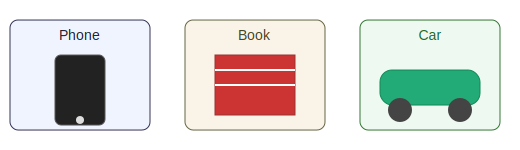
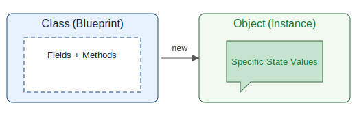
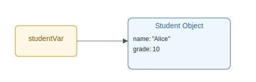
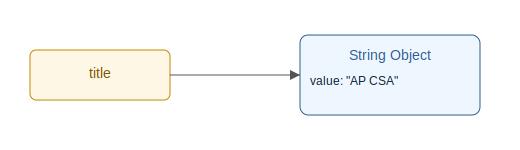
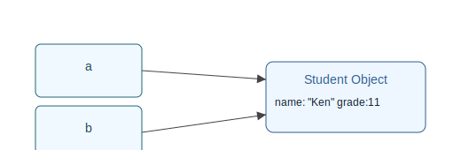

# Unit 1.7 Objects

## Learning Goals
By the end of this unit, you will:
- Distinguish a class (blueprint) from an object (instance)
- Create objects using `new` and constructor syntax
- Call methods on objects using dot notation
- Understand reference variables and memory references
- Recognize aliasing and how it affects program behavior
- Understand `null` and avoid `NullPointerException`
- Use the `String` class and `equals()` method correctly

## 1. Learning Goals

By the end you can:
- Distinguish a class vs an object instance
- Create objects with `new` and call their methods
- Understand reference variables (variables store addresses, not the object itself)
- Explain and detect aliasing (two references to the same object)
- Use simple provided classes (e.g., `String`, custom `Point` or `Student`)
- Recognize `null` and avoid `NullPointerException`

## 2. Real-World Analogy

Look around: a phone, a book, a car. Each is an object with properties (state) and abilities (behavior).


In Java, we model things with classes (blueprints) and create actual objects (houses built from the blueprint).


## 3. Class vs Object
- Class: Definition / blueprint (what fields exist, what methods do)
- Object: A specific instance with its own data values

Example (pretend `Student` class already defined elsewhere):
```java
Student alice = new Student("Alice", 10);
Student bob = new Student("Bob", 11);
```
`alice` and `bob` are two distinct objects. Changing `alice` does not change `bob`.

## 4. Reference Variables
A variable of a class type holds a reference (an address) to the object in memory—not the object contents directly.


Important consequences:
- Assigning one reference to another copies the address (aliasing)
- Comparison with `==` checks if two references point to the same object (for most exam scenarios use `.equals` for `String` content comparison)

## 5. Creating Objects with `new`
Syntax:
```java
ClassName variableName = new ClassName(arguments);
```
Steps conceptually:
1. Allocate memory for object
2. Initialize its fields (via constructor)
3. Return reference and store in variable

Example using `String` (special syntax also allows string literals):
```java
String title = new String("AP CSA"); // rarely needed; just: String title = "AP CSA";
```

## 6. Fields and Methods (State & Behavior)
An object bundles:
- Fields (data/state)
- Methods (actions/behavior)

Example using `Student`:
```java
Student stu = new Student("Ria", 10); // fields like name, grade set
int g = stu.getGrade();                 // accessor method reads state
stu.setGrade(11);                       // mutator method changes state
```
You call a method on an object using dot syntax: `objectName.methodName(arguments);`

## 7. Constructors
A constructor sets the initial state when you create an object.
Signature: same name as class, no return type.
```java
public class Student {
	private String name;
	private int grade;

	public Student(String name, int grade) {
		this.name = name;
		this.grade = grade;
	}
}
```
Calling:
```java
Student s = new Student("Amy", 10);
```
If no constructor is written, Java provides a default (no parameters) if no other constructors exist.

## 8. The `String` Class (Very Common)
`String` is a class, not a primitive. Literals like `"Hello"` create `String` objects automatically.


Key points:
- Strings are immutable (methods do not modify original; they return new strings)
- Compare content with `equals`, not `==`
```java
String a = "hi";
String b = "hi";
System.out.println(a == b);      // may be true (same literal interned)
System.out.println(a.equals(b)); // always true (content)
```

## 9. Aliasing
Two references can point to the same object.

```java
Student x = new Student("Ken", 11);
Student y = x; // y aliases x
y.setGrade(12); // affects x as well
```

## 10. `null`
`null` means "no object". A reference no longer (or not yet) points to any instance.

```java
Student temp = null;
if (temp == null) {
	System.out.println("No student yet");
}
```
Always check if a reference can be null before calling methods.

## 11. Pass-by-Value (Reference Copy)
Java passes arguments by value. For objects, the value copied is the reference (address).
```java
public static void promote(Student s) {
	s.setGrade(s.getGrade() + 1);
}
Student t = new Student("Tom", 10);
promote(t); // t grade becomes 11
```
Reassigning parameter does not affect caller's reference:
```java
public static void reassign(Student s) {
	s = new Student("New", 9); // local only
}
reassign(t); // t still refers to original Student
```

## 12. Best Practices Right Now
| Topic | Guidance |
|-------|----------|
| Naming | Class names Capitalized; variables camelCase |
| Aliasing | Only create when intended |
| String Comparison | Use `equals` for content |
| Null Safety | Initialize promptly; check before use |
| Constructor | Set all required fields |
| Method Focus | Keep methods single-purpose |

## 13. Practice
### A. Concept / Short Answer
1. Explain the difference between a class and an object using a blueprint analogy.
2. Why does assigning `Student y = x;` not create a second copy of the student data?
3. What does `null` represent? Provide a safe pattern to avoid a crash when a variable might be null.
4. Why is `a.equals(b)` preferred over `a == b` for strings?
5. Describe the sequence of events when `new Student("Liu", 12);` executes.

### B. Tracing
Given:
```java
Student s1 = new Student("Li", 9);
Student s2 = new Student("Mei", 10);
Student s3 = s2;
s2.setGrade(11);
s1 = s3;
```
6. After execution, how many distinct `Student` objects exist? What grade does each variable refer to?
7. After the reassignment `s1 = s3;` explain whether `s1` and `s2` refer to the same object and justify your answer.

### C. Code Writing
8. Write a class `Box` with private `int width`, `int height`, a constructor, an `area()` method, and `grow(int dw, int dh)`.
9. Write a static method `swapNames(Student a, Student b)` that swaps names without reassigning `a` or `b`.
10. Write a static method `cloneName(Student a)` returning a NEW `Student` with same name and grade 1.

### D. Aliasing / Pass-by-Value
11. What prints?
```java
public static void change(Student s) {
	s = new Student("X", 1);
}
public static void bump(Student s) {
	s.setGrade(s.getGrade() + 1);
}
Student z = new Student("Zoe", 9);
change(z);
bump(z);
System.out.println(z.getGrade()); // ?
```
12. Modify `change` so caller sees a different name afterward (change a field, not the reference).

### E. Multiple Choice
13. Which statement creates a new object? (A) `Student a = b;` (B) `Student a = new Student("Ria", 10);` (C) `a = c;` (D) `a.getGrade();`
14. Given `String a = "hi"; String b = "hi";` which is ALWAYS true? (A) `a == b` (B) `a.equals(b)` (C) both (D) neither
15. After:
```java
Student p = new Student("P", 8);
Student q = p;
q.setGrade(9);
```
What is `p.getGrade()`? (A) 8 (B) 9 (C) undefined (D) error

### F. Challenge
16. Implement `public void add(Counter other)` that adds `other`'s value into `this` safely if `other == this`.
17. Explain (2–3 sentences) how aliasing can cause bugs in shared data structures.
18. Design a `StudentFactory.freshman(String name)` returning a grade 9 student. Why useful?

### G. Reflection
19. Describe a scenario where checking for `null` prevents a crash.
20. If a method should not modify an object passed in, what practice helps enforce that?

## Key Takeaways
- Objects are instances of classes; classes are blueprints
- Reference variables hold addresses pointing to objects in memory
- Use `new` to create object instances
- Call methods with dot notation: `object.methodName(arguments)`
- Aliasing (two references to same object) means changes affect both
- Use `equals()` for `String` content comparison, not `==`
- Check for `null` before calling methods to avoid `NullPointerException`
- Understand pass-by-value: arguments pass copies of references, not reassignments
- Strings are immutable; methods return new `String` objects
- `null` means no object; check before use
- Pass-by-value copies the reference, not the object
- Clear naming and focused methods improve readability

Practice tracing variable references until predictions feel automatic.