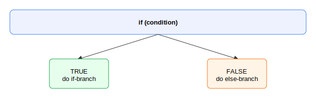
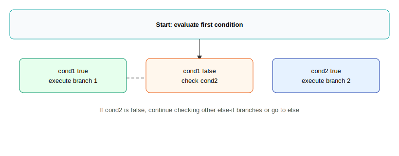

# Unit 2.2 — If Statements

This chapter covers the basic conditional statements used in Java: `if`, `else`, and `else if`.
It focuses only on single comparisons and single `if`/`else if`/`else` chains. Nested `if` statements and
compound boolean expressions (using `&&`, `||`, or `!`) are intentionally excluded and will be
introduced in later chapters.

**Goals**
- Understand the purpose of `if`, `else`, and `else if`.
- Learn correct Java syntax for each construct.
- Read simple examples and predict their output.
- Write short programs using single-condition `if` statements.

**Prerequisites**
- Familiarity with Java variables, types (especially `int`, `double`, `boolean`, and `String`), and basic I/O.

## 1. What is a conditional statement?

A conditional statement lets the program make a decision: run some code only when a condition is true.
In Java the condition inside an `if` must evaluate to a `boolean` value (`true` or `false`).

Example (English): "If it is raining, take an umbrella." In code we check a condition and execute the block that follows.

## 2. `if` — Basic form

Syntax:

```java
if (condition) {
    // statements that run when condition is true
}
```

Notes:
- `condition` must be a boolean expression (for now, a single comparison like `x > 10`).
- The block inside `{}` runs only when `condition` is `true`.

Example:

```java
int score = 85;
if (score >= 60) {
    System.out.println("Pass");
}
```

Output:

Pass

Explanation: The condition `score >= 60` is true, so the println executes. If `score` were 50, nothing would print.

**If you omit the braces, only the single next statement is controlled by the `if`. Indentation doesn't change behavior: Indentation helps readability but Java uses braces to decide which statements belong to the `if`.**

```java
int score = 0;
if (score > 60)
    System.out.println("You passed");
    System.out.println("Score report");

// Above code block will print:
// Score report
```

`System.out.println("You passed");` is the only line inside if statement when braces are omitted. 

### Execution flow after `if` statements

- **What runs after the `if`/`else` chain:** Once an `if`/`else if`/`else` branch finishes, execution continues with the next statement that follows the entire `if` chain, unless a branch changes the flow 


```java
int x = 5;
if (x > 0) {
    System.out.println("positive");
}
System.out.println("done");
```

Output:

positive
done

Explanation: The second `println` runs regardless of the `if` because only the single statement immediately after `if` is controlled when braces are omitted.

Example (with braces — both lines controlled):

```java
int x = 5;
if (x > 0) {
    System.out.println("positive");
    System.out.println("done inside if");
}
```

Output:

positive
done inside if

Explanation: Both prints are inside the `if` block and only run when the condition is true.

## 3. `if` with `else` — Two-way decision

Syntax:

```java
if (condition) {
    // runs when condition is true
} else {
    // runs when condition is false
}
```

Example:

```java
int temperature = 72;
if (temperature > 75) {
    System.out.println("It's hot");
} else {
    System.out.println("It's not hot");
}
```

Output (for the example):

It's not hot

Explanation: `temperature > 75` is false, so the `else` block runs.



## 4. `else if` — Multi-way decision
A teacher wants to write a program to calculate the letter grade based on numeric grade. Check below code, would it work as expected?

```java
int score = 75;
if (score >= 90) {
    System.out.println("A");
}
if (score >= 80) {
    System.out.println("B");
}
if (score >= 70) {
    System.out.println("C");
}
if (score < 70) {
    System.out.println("D or F");
}
```

Use `else if` to check additional conditions when the prior `if` or `else if` conditions are false. Only the first true branch executes.

Syntax:

```java
if (condition1) {
    // runs when condition1 is true
} else if (condition2) {
    // runs when condition1 is false and condition2 is true
} else {
    // runs when none of the above are true
}
```

Example:

```java
int score = 75;
if (score >= 90) {
    System.out.println("A");
} else if (score >= 80) {
    System.out.println("B");
} else if (score >= 70) {
    System.out.println("C");
} else {
    System.out.println("D or F");
}
```

Output:

C

Explanation: Conditions are tested top to bottom. `score >= 90` is false, `score >= 80` is false, `score >= 70` is true, so that branch runs and the rest are skipped.


Important: Do not write separate `if` statements when you intend a single chain — use `else if` to ensure only one branch runs.

## 5. Common mistakes and clarifications

- Forgetting parentheses: `if condition { ... }` is invalid — always write `if (condition) { ... }`.
- Using `=` instead of `==`: `=` assigns a value; `==` compares primitive values. Example: `if (x = 5)` is invalid in Java; use `if (x == 5)`.
- Comparing strings: do not use `==` to compare `String` contents. Use `equals` (e.g., `if (s.equals("hi"))`). This chapter focuses on primitives; string comparison will be discussed later.
- Multiple independent `if` statements vs. `else if` chain: two separate `if` statements both run if true; an `if`/`else if`/`else` chain runs only one matching branch. For single-choice logic use `else if`.

## 6. Short examples (no nesting, no compound booleans)

- Example 1 — Check even/odd using a single comparison (remainder logic is allowed but keep it single condition):

```java
int n = 4;
if (n % 2 == 0) {
    System.out.println("Even");
} else {
    System.out.println("Odd");
}
```

## 7. Nested `if`

Nested `if` statements are `if` statements placed inside another `if` (or `else`) block. They let you check a second condition only when the first condition is true (or false, if placed inside an `else`). Nested `if` is helpful when decisions depend on earlier checks. This section introduces simple nested `if` examples — still avoiding compound boolean operators.

Example 1 — Simple nested check:

```java
int age = 20;
if (age >= 18) {
    System.out.println("Adult");
    if (age >= 21) {
        System.out.println("Allowed to drink");
    }
}
```

Output:

Adult

Explanation: The outer `if` is true so its block runs. The inner `if` is false (age < 21) so only `Adult` prints.

Example 2 — Nested inside `else`:

```java
int score = 65;
if (score >= 70) {
    System.out.println("Great");
} else {
    if (score >= 60) {
        System.out.println("Pass");
    } else {
        System.out.println("Fail");
    }
}
```

Output:

Pass

Explanation: `score >= 70` is false, so we enter the `else` block and evaluate the nested `if`.

### Nested practice

1) What does this print?

```java
int x = 4;
if (x > 0) {
    if (x % 2 == 0) {
        System.out.println("Positive even");
    }
}
```

2) Write a nested `if` that prints `"valid"` if an integer `n` is between 1 and 100 inclusive, and prints `"out of range"` otherwise. Use nesting (do not use compound booleans).

3) Predict output:

```java
int a = 10;
if (a > 5) {
    System.out.println("big");
    if (a > 10) {
        System.out.println("bigger");
    } else {
        System.out.println("not bigger");
    }
}
```

## 8. Practice problems

1) What does the following program print?

```java
int x = 10;
if (x > 5) {
    System.out.println("A");
} else if (x > 8) {
    System.out.println("B");
} else {
    System.out.println("C");
}
```

2) Write an `if`/`else if`/`else` chain that prints `"small"`, `"medium"`, or `"large"` for an integer `n` where `n < 10` => `small`, `10 <= n < 20` => `medium`, otherwise `large`.

3) Predict output:

```java
int age = 17;
if (age >= 18) {
    System.out.println("Adult");
} else {
    System.out.println("Minor");
}
```

4) Which branch executes in the code below? Explain briefly.

```java
int a = 5;
if (a == 5) {
    System.out.println("one");
} else if (a == 5) {
    System.out.println("two");
}
```

---


## 9. Practice answers

### Nested practice answers

1) Output: `Positive even` (since 4 > 0 and 4 % 2 == 0).

2) Example solution:

```java
if (n >= 1) {
    if (n <= 100) {
        System.out.println("valid");
    } else {
        System.out.println("out of range");
    }
} else {
    System.out.println("out of range");
}
```

3) Output:

big
not bigger

Explanation: `a > 5` is true so `big` prints. `a > 10` is false so the inner `else` prints `not bigger`.

### General practice answers

1) Output: `A`

Explanation: `x > 5` is true, so the first `if` runs. The `else if` is not evaluated once a true branch has executed.

2) Example solution:

```java
if (n < 10) {
    System.out.println("small");
} else if (n < 20) {
    System.out.println("medium");
} else {
    System.out.println("large");
}
```

3) Output: `Minor` — `age >= 18` is false.

4) Output: `one`

Explanation: The first `if (a == 5)` is true and its branch runs; the `else if` is not reached because the chain already matched.

## 10. Quick checklist for writing `if` statements

- Use parentheses after `if` and `else if`.
- Use `==` for primitive equality comparison.
- Choose `else if` when branches are mutually exclusive and only one should run.
- Keep conditions simple for now — no logical operators or nesting.

